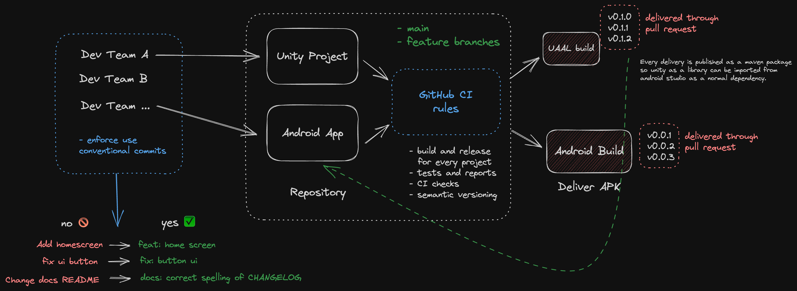

<h1 align="center">
  ind-mazda-hmi-prod-ivi
</h1>


# Overview

This repository contains the Unity project and Android App project, the workflow for this is simple for now. You can check the following image.


### Folder Structure:

```
|-MazdaIVI
|-NativeAndroid
```

**MazdaIVI** :	- Unity Project that gets embedded into the native Android application.

**NativeAndroid**:	- native Android application, built with AndroidStudio 2022.3.1.



# Getting started

To start working with this repo you can clone it locally. The first thing you would need to do after cloning the repo is configuring a couple of tools that automate some tasks.

## What you need
- [Node version >= 18](https://nodejs.org/en/download)
- [Git](https://git-scm.com/)
- [Unity Editor](https://www.docker.com/get-started/)
- [Android Studio](https://docs.docker.com/compose/)

#TODO: add versions

## Install Git Hooks
First install git hooks inside the root folder of this project:

```
npm install
```

that's it. really? yes, that's it.

# TODO: add docs for configuring env for android

### Good to know 👇


#### Conventional commits

One of the things that might be different from other projects you've worked on is the commits convention we use. We use conventional commits to automate semantic versioning, release notes and other tasks. In a nutshell conventional commits is a way to define your commit messages with a more semantic meaning. You can find more info [here](https://www.conventionalcommits.org/en/v1.0.0/).

#### Why Use Conventional Commits
- Automatically generating CHANGELOGs.
- Automatically determining a semantic version bump (based on the types of commits - landed).
- Communicating the nature of changes to teammates.
- Triggering build and publish processes.
- Making it easier for people to contribute, by allowing them to - explore a more structured commit history.
